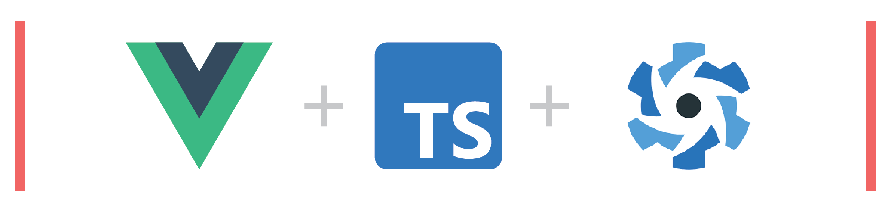

# Contribution guide

Welcome to the Vue3 + TS + Quasar GitHub showcases contribution guide.

We're glad to see that you'd love to contribute. This document will try to get you up to speed as fast and as smoothly as possible.

If you were instead looking to just run the application, then please read our [README](README.md) for details on how to do so.

### Key Technologies used

- [Vue 3](https://vuejs.org/) - A progressive frontend framework.
- [Apollo](https://www.apollographql.com/) - A tool that simplifies how we work with GraphQL
- [Typescript](https://www.typescriptlang.org/) - TypeScript is a strongly typed programming language that builds on JavaScript, giving you better tooling at any scale.
- [Quasar 2.x](https://quasar.dev) - A Vue.js based framework, which allows you as a web developer to quickly create responsive websites/apps in many flavours. It also contains several ready-made UI components that accelerate the development of this project.
- [Yarn](https://yarnpkg.com/) - We'll be using this to manage our dependencies.

### Other technologies used

- [GraphQL]() with [Apollo]() - We use this for **fetching data** from the [GitHub GraphQL API](https://docs.github.com/en/graphql) and it allows us to only retrieve the information we want at any given point in time.
- [Pinia](https://pinia.vuejs.org/) - Pinia the official Vue3 recommended **state management** solution that offers a cleaner API and simpler API than [VueX](https://vuex.vuejs.org/), it's predecessor. It is useful for managing global state in our application such as storing information about our currently logged in user.
- [Storybook](https://storybook.js.org/) - Storybook provides us with **an interface that can be used by non-developers to make design decisions** without needing to code. Each storybook acts as a sort of design document for the entire application and can further streamline the interactions between stakeholders/designers and the engineers that do the actual building of the product.

## Project structure

--

## Architectural decisions

--

## Process for adding a feature

--

## Reporting bugs

--
