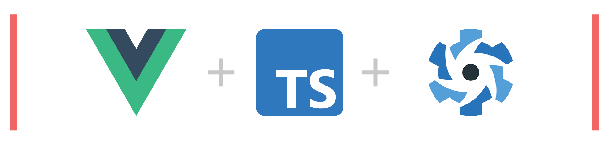

# Starter.dev - GitHub Showcases

Somewhere around here, there should be _some wise summary on what GitHub Showcases is actually about_. Well... If not, please check out the [base repository's readme.](https://github.com/thisdot/starter.dev-github-showcases/blob/main/README.md)



## Vue3 + TS + Quasar

This is the VueJS 3, Typescript and quasar implementation of the github showcases.
A demo for this version of the application can be found at [vue3-apollo-quasar.starter.dev](https://vue3-apollo-quasar.starter.dev/)

### Key Technologies used

- [Vue 3](https://vuejs.org/) - A progressive frontend framework.
- [GraphQL](https://graphql.org/) with [Apollo](https://www.apollographql.com/) - We use this for **fetching data** from the [GitHub GraphQL API](https://docs.github.com/en/graphql) and it allows us to only retrieve the information we want at any given point in time.
- [Typescript](https://www.typescriptlang.org/) - TypeScript is a strongly typed programming language that builds on JavaScript, giving you better tooling at any scale.
- [Quasar 2.x](https://quasar.dev) - A Vue.js based framework, which allows you as a web developer to quickly create responsive websites/apps in many flavours. It also contains several ready-made UI components that accelerate the development of this project.
- [Yarn](https://yarnpkg.com/) - We'll be using this to manage our dependencies.

## Pre-requisites

Before being able to run this project, you will need to have a few things installed

- [NodeJS v16.x and above](https://nodejs.org/) - You can install this via the official website bute we'd recommend using a tool like [NVM](https://github.com/nvm-sh/nvm) to be able to install multiple versions of node locally at the same time.

> It is **worth noting** that installing NodeJS will also install `npm` which we shall use to install `yarn` in the next step.

- [Yarn](https://yarnpkg.com/) - Our package manager of choice

  - You can install yarn using the following command _once you have NodeJS installed_.

  ```
    npm install --global yarn
  ```

And... That's it! Once you have these down, you're ready to get this up and running.

## Setting up

Clone this project by running

```git
git clone https://github.com/thisdot/starter.dev-github-showcases.git
```

Once cloned, enter the project directory like so

```
cd .\starter.dev-github-showcases\vue3-ts-quasar
```

Please not that the project is setup as a mono-repo, which means that the different versions of GitHub showcases using different technologies each belong in a separate directory in the root directory of the project.

For more information on how the Vue3 + TS + Quasar version of the project is structured, please refer to the [contribution guide](CONTRIBUTING.md)

### Install dependencies

Run this command in your command line while in the `vue3-ts-quasar/` directory of the project to install dependencies.

```
yarn install
```

###

### Run Storybook

To run storybook, use the following command in your command line

```
yarn storybook
```

You can then access your storybook via [localhost:6006/](http://localhost:6006/)

#### Fix for StoryBook

> Initially storybook was not working with the default scaffolded application

The issue was with some dependencies like `style-loader`, `sass-loader` and `css-loader`. The recent versions don’t work with vue2 and 3.

so these are the versions that worked:

```
"sass-loader": "^10.0.2",
"style-loader": "^1.3.0",
"css-loader": "^4.3.0",
```

Also another dependency `@storybook/preset-scss` **is required** which is to be added in the “addons” array in the [main.js](.storybook/main.js) file inside the `.storybook/` directory after successfully installing it using `yarn`.

### Run the application

To run your application, use the following command in your command line

```
yarn serve
```

You can then access your application via [localhost:8080/](http://localhost:8080/)

Congrats! You're in.

## Lints and fixes files

We use ESLint for linting and Prettier for formatting the code in this codebase. To run the linter, use the following command:

```
yarn lint
```

### Running unit tests

The unit tests for this application are written in [Jest](https://jestjs.io/) and can be run using the following command:

```
yarn test:unit
```

### Building the application

To deploy the application, you will first need to build it. You can build it using the following command:

```
yarn build
```

Your built application files will reside in `dist/spa/` in your root vue3-ts-quasar directory.

### Custom Icon with quasar

Ensure the svg is saved in the public folder and attach an id to the svg.

```vue
<q-icon name="svguse:iconName.svg#svgid" />
```

you can learn more about svg use from [here](https://quasar.dev/vue-components/icon#svg-use-way).

also another dependency `@storybook/preset-scss` is required which is to be added in the “**addons**” array in the `main.js` file inside the `.storybook` folder after successfully installing it using `yarn` or `npm`.

## Customize VueJS configuration

See [Configuration Reference.](https://cli.vuejs.org/config/)

# [Contributing](CONTRIBUTING.md)

If you would like to contribute to this project, great! We're glad to have you here.

You can check out the [contribution guide](CONTRIBUTING.md) to understand what technologies are used as well as how the project is structured and how you can contribute.

---

### Acknowledgement

The Quasar Logo is licensed under a Creative Commons Attribution 4.0 International License by [Emanuele Bertoldi.](https://github.com/zuck)
